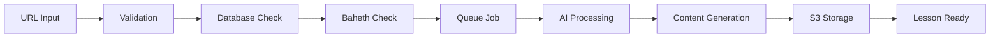

# 📚 Merqam Documentation

Welcome to the Merqam documentation! This guide will help you understand how to search for and request Islamic educational content on our platform.

## 📋 Table of Contents

- [🎯 Getting Started](#-getting-started)
- [🔍 Lesson Search & Request System](#-lesson-search--request-system)
- [👨‍💼 Admin Interface](#-admin-interface)
- [🔒 Security & Authentication](#-security--authentication)
- [⚙️ Technical Architecture](#️-technical-architecture)

## 🎯 Getting Started

Merqam is your gateway to Islamic educational content from YouTube videos. Our platform processes videos to create interactive lessons with features like highlighting, note-taking, and synchronized video playback.

### Quick Start Guide
1. **Visit the homepage** and enter a YouTube video URL
2. **Check availability** - we'll search our database and external sources
3. **Choose your option** based on what we find
4. **Track progress** if you request new content

---

## 🔍 Lesson Search & Request System

Our intelligent system handles three main scenarios when you search for a lesson:

### 📌 Scenario 1: Lesson Already in Merqam ✅

> **🎯 What happens:** Content already exists as a fully processed lesson

**✨ Features Available:**
- Full interactive lesson experience
- Highlighting and note-taking
- Synchronized video playback
- Progress tracking

**🚀 User Experience:**
- Instant redirect to lesson page
- All interactive features enabled
- No waiting time required

---

### 📌 Scenario 2: Available in Baheth (External Source) 🔄

> **🎯 What happens:** Content exists in our partner database but isn't fully processed

**📋 Two Options Presented:**

#### Option A: Read-Only Mode 👀
- **Access:** Immediate
- **Features:** Basic content viewing
- **Limitations:** No interactive features
- **Best for:** Quick reference or immediate access

#### Option B: Request Full Processing ⚡
- **Access:** After processing (typically 15-30 minutes)
- **Features:** Complete interactive experience
- **Benefits:** Enhanced metadata from Baheth source
- **Best for:** Study sessions requiring full features

**🔧 Technical Details:**
- Uses Baheth API metadata for enhanced processing
- Speaker and playlist information automatically populated
- Optimized transcript extraction from external source

---

### 📌 Scenario 3: Not Available Anywhere 🆕

> **🎯 What happens:** Content doesn't exist in any system

**📝 Request Process:**
- Submit request with default metadata
- System processes from scratch using AI
- Full lesson creation pipeline activated

**⏱️ Processing Timeline:**
- **Immediate:** Request submitted and queued
- **5-10 minutes:** Transcript extraction
- **15-30 minutes:** AI enhancement and structuring
- **Ready:** Full interactive lesson available

**🤖 AI Enhancement:**
- Content structuring and organization
- Arabic text processing and improvement
- Topic extraction and categorization
- Interactive element generation

---

## 🔒 Security & Authentication

### 🔐 User Authentication

**Supported Methods:**
- 📧 **Email/Password:** Traditional registration
- 🌐 **Google OAuth:** One-click social login
- 🔑 **JWT Tokens:** Secure session management

**Security Features:**
- HTTP-only cookies for token storage
- Automatic token refresh
- Secure password hashing with bcrypt

### 🛡️ Abuse Prevention

**Rate Limiting:**
- **3 requests per hour** per authenticated user
- **1-hour cooldown** between retry attempts
- Smart job deduplication

**Request Validation:**
- URL format validation for multiple YouTube patterns
- Duplicate request prevention
- User ownership verification for all operations

**Authentication Requirements:**
- ✅ **Required for:** Requesting new lessons, retrying failed jobs
- ✅ **Not required for:** Browsing existing content, read-only access

---

## 👨‍💼 Admin Interface

### 📊 Job Management Dashboard

**Access:** `/admin/jobs` (Admin credentials required)

**Features:**
- 👥 **Multi-User View:** See jobs from all users
- 📈 **Real-Time Updates:** Live status monitoring
- 🔄 **Job Operations:** Cancel, retry, and track progress
- 📋 **User Attribution:** See which user created each job

**Job States:**
```
pending → processing → completed ✅
    ↓         ↓
cancelled   failed → (cooldown) → retry
```

### 🔍 Monitoring & Debugging

**Available Information:**
- Job creation timestamp and user
- Processing progress and current status
- Detailed error logs for failed jobs
- Queue statistics and performance metrics

**Administrative Actions:**
- Cancel running jobs
- Retry failed jobs (respects user ownership)
- View detailed processing logs
- Monitor system health

---

## ⚙️ Technical Architecture

### 🏗️ System Components

**Frontend Stack:**
- **Framework:** Next.js 15 with React 19
- **Styling:** Tailwind CSS with shadcn/ui
- **State Management:** React Query + Zustand
- **Authentication:** JWT with HTTP-only cookies

**Backend Stack:**
- **API:** Next.js server actions
- **Database:** PostgreSQL with Kysely ORM
- **Queue System:** BullMQ with Redis
- **Storage:** AWS S3 for lesson content

**Processing Pipeline:**
- **Video Analysis:** YouTube transcript extraction
- **AI Enhancement:** OpenAI/Gemini integration
- **Content Generation:** MDX format with interactive elements
- **Storage:** S3-based CDN delivery

### 🔄 Job Processing Flow



### 📂 Key Files Reference

**Authentication System:**
- [`packages/web/src/server/lib/auth/server-action-auth.ts`](../packages/web/src/server/lib/auth/server-action-auth.ts) - Server action authentication
- [`packages/web/src/server/lib/auth/admin-auth.ts`](../packages/web/src/server/lib/auth/admin-auth.ts) - Admin authorization
- [`packages/web/src/client/hooks/use-auth-query.ts`](../packages/web/src/client/hooks/use-auth-query.ts) - Client authentication hooks

**Lesson Request System:**
- [`packages/web/src/app/actions/requestLessonGeneration.ts`](../packages/web/src/app/actions/requestLessonGeneration.ts) - Main request handler
- [`packages/web/src/client/components/youTubeSearch.tsx`](../packages/web/src/client/components/youTubeSearch.tsx) - Search interface
- [`packages/web/src/app/request/[youtube_video_id]/page.tsx`](../packages/web/src/app/request/[youtube_video_id]/page.tsx) - Request status page

**Admin Interface:**
- [`packages/web/src/app/admin/jobs/page.tsx`](../packages/web/src/app/admin/jobs/page.tsx) - Admin dashboard
- [`packages/web/src/client/components/jobs/job-list-component.tsx`](../packages/web/src/client/components/jobs/job-list-component.tsx) - Job management UI
- [`packages/web/src/app/admin/jobs/lessons-queue/actions.ts`](../packages/web/src/app/admin/jobs/lessons-queue/actions.ts) - Admin backend actions

**Queue Processing:**
- [`packages/lessons-worker/src/queue/lesson-generation-worker.ts`](../packages/lessons-worker/src/queue/lesson-generation-worker.ts) - Job processor
- [`packages/web/src/app/admin/jobs/lessons-queue/queue-config.ts`](../packages/web/src/app/admin/jobs/lessons-queue/queue-config.ts) - Queue configuration

---

## 🚀 Recent Enhancements

### ✨ New Features Added

**🔐 Enhanced Authentication:**
- Server-side authentication in all actions
- Proper admin authorization system
- User ownership validation for job operations

**🎯 Smart Job Management:**
- Intelligent retry logic for failed jobs
- Rate limiting with 1-hour cooldowns
- Automatic cleanup of old failed jobs

**👥 Improved Admin Interface:**
- Multi-user job visibility
- User attribution for all requests
- Real-time status updates and monitoring

**🛡️ Security Improvements:**
- Input validation and sanitization
- Protection against request abuse
- Secure admin-only routes

---

## 📞 Getting Help

### For Users
- **Search Issues:** Try different URL formats or contact support
- **Login Problems:** Use password reset or Google OAuth
- **Processing Delays:** Check status page for updates

### For Administrators  
- **Job Management:** Use admin dashboard for monitoring
- **System Issues:** Check logs in job detail pages
- **User Support:** Review user request history and status

### Technical Support
- **Documentation:** This guide and inline code comments
- **Development:** See [`CLAUDE.md`](../CLAUDE.md) for technical details
- **Issues:** Contact development team with specific error details

---

**📝 Last Updated:** January 2025  
**🔄 Version:** 2.0 - Enhanced Authentication & Admin Features  
**👥 Team:** Merqam Development Team