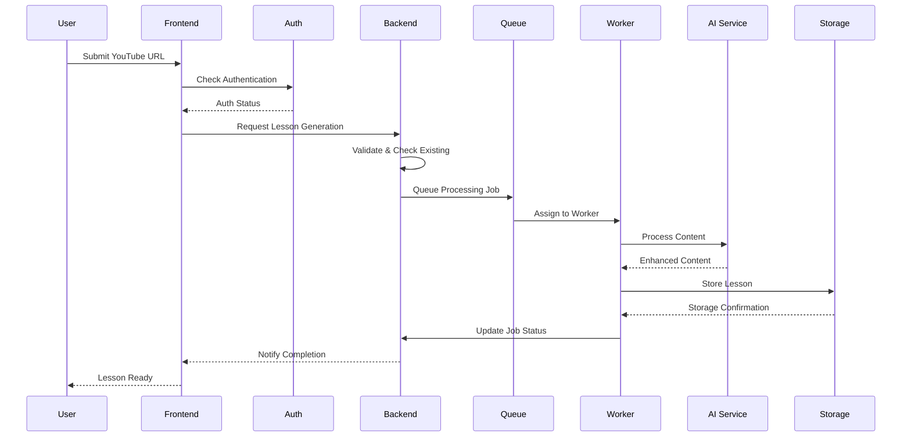

# 🔧 Technical Overview - Architecture & Implementation

## 🏗️ System Architecture

### 📊 High-Level Overview

```
┌─────────────────┐    ┌─────────────────┐    ┌─────────────────┐
│   Frontend      │    │   Backend       │    │   Workers       │
│   (Next.js)     │◄──►│   (Server       │◄──►│   (BullMQ)      │
│                 │    │   Actions)      │    │                 │
└─────────────────┘    └─────────────────┘    └─────────────────┘
         │                       │                       │
         ▼                       ▼                       ▼
┌─────────────────┐    ┌─────────────────┐    ┌─────────────────┐
│   Auth System   │    │   PostgreSQL    │    │   AI Services   │
│   (JWT/OAuth)   │    │   Database      │    │   (OpenAI/      │
│                 │    │                 │    │   Gemini)       │
└─────────────────┘    └─────────────────┘    └─────────────────┘
```

### 🔄 Request Flow



---

## 🔐 Authentication System

### 🏗️ Architecture Components

**JWT-Based Authentication:**
- **Storage:** HTTP-only cookies for security
- **Tokens:** Access + Refresh token pattern
- **Expiration:** Automatic refresh handling
- **Security:** XSS and CSRF protection

**File References:**
```
📁 Authentication System
├── 🔐 packages/web/src/server/lib/auth/
│   ├── server-action-auth.ts    # Server-side auth helpers
│   ├── admin-auth.ts           # Admin authorization
│   ├── jwt.ts                  # Token management
│   └── password.ts             # Password hashing
├── 🖥️ packages/web/src/client/hooks/
│   ├── use-auth-query.ts       # Client auth hooks
│   └── use-auth.ts            # Legacy auth (deprecated)
└── 🔧 packages/web/src/client/services/
    └── auth.service.ts         # Authentication API calls
```

### 🔄 Flow Implementation

**Server Actions Authentication:**
```typescript
// server-action-auth.ts
export async function requireAuth(): Promise<User> {
  const cookieStore = cookies();
  const token = cookieStore.get('token')?.value;
  
  if (!token) {
    throw new Error('Authentication required');
  }
  
  const user = await verifyJWT(token);
  return user;
}
```

**Client-Side Integration:**
```typescript
// use-auth-query.ts
export function useSession() {
  return useQuery({
    queryKey: AUTH_KEYS.session,
    queryFn: async () => {
      const user = await authService.getProfile();
      return { user };
    },
    staleTime: 1000 * 60 * 5, // 5 minutes
  });
}
```

---

## 📊 Job Management System

### 🔄 Queue Architecture

**BullMQ Implementation:**
- **Queue:** Redis-backed job queue
- **Workers:** Multiple concurrent processors
- **Priorities:** Job prioritization support
- **Retry Logic:** Configurable retry policies
- **Monitoring:** Real-time job tracking

**File Structure:**
```
📁 Job Management
├── 🏭 packages/lessons-worker/src/queue/
│   ├── lesson-generation-worker.ts  # Main worker logic
│   ├── job-error-utils.ts          # Error handling
│   └── job-progress-utils.ts       # Progress tracking
├── ⚙️ packages/web/src/app/admin/jobs/lessons-queue/
│   ├── actions.ts                  # Server actions
│   ├── queue-config.ts             # Queue configuration
│   └── temp.ts                     # Temporary types
└── 🖥️ packages/web/src/client/components/jobs/
    ├── job-list-component.tsx      # Admin UI
    └── grouped-jobs-list.tsx       # Grouped view
```

### 🎯 Job Lifecycle

**State Machine:**
```typescript
type JobStatus = 'pending' | 'processing' | 'completed' | 'failed' | 'cancelled';

// Job progression
pending → processing → completed ✅
    ↓         ↓
cancelled   failed → (cooldown) → retry
```

**Smart Retry Logic:**
```typescript
async function handleExistingJob(job: Job): Promise<RequestGenerationResult | null> {
  switch (job.status) {
    case 'failed':
    case 'cancelled':
      // Check 1-hour cooldown
      const oneHourAgo = new Date(Date.now() - 60 * 60 * 1000);
      if (job.updated_at > oneHourAgo) {
        return { error: `Wait ${waitMinutes} minutes before retry` };
      }
      
      // Delete old job and allow retry
      await db.deleteFrom('generation_jobs').where('id', '=', job.id).execute();
      return null; // Allow new job creation
  }
}
```

---

## 🤖 AI Integration

### 🏭 Factory Pattern Implementation

**AI Service Selection:**
```typescript
// ai-service.factory.ts
export class AIServiceFactory {
  static createService(type: AIServiceType): BaseAIService {
    switch (type) {
      case 'openai':
        return new OpenAIService();
      case 'gemini':
        return new GeminiService();
      default:
        throw new Error(`Unknown AI service: ${type}`);
    }
  }
}
```

**Processing Pipeline:**
```
📊 Content Processing Flow
1. 📹 Video Analysis     → Extract transcript
2. 🧠 AI Enhancement     → Structure content
3. 📝 Content Generation → Create MDX format
4. 🎯 Interactive Elements → Add exercises/highlights
5. 💾 Storage           → Save to S3
```

### 🔧 Service Implementations

**File Structure:**
```
📁 AI Services
├── 🏭 packages/lessons-worker/src/services/ai/
│   ├── ai-service.factory.ts    # Service factory
│   ├── base-ai.service.ts       # Abstract base class
│   ├── openai.service.ts        # OpenAI implementation
│   ├── gemini.service.ts        # Gemini implementation
│   ├── text-chunking.service.ts # Content chunking
│   └── validation.service.ts    # Output validation
└── 🔧 Content Processing
    ├── prompts.ts              # AI prompts
    ├── types.ts               # Service types
    └── gemini-key-manager.ts  # API key rotation
```

---

## 💾 Database Layer

### 🏗️ Schema Design

**Core Tables:**
- **users:** Authentication and user management
- **generation_jobs:** Job tracking and status
- **lessons:** Processed lesson content
- **playlists:** Content organization
- **highlights:** User annotations
- **notes:** User-generated content

**Kysely ORM Integration:**
```typescript
// Type-safe database queries
const jobs = await db
  .selectFrom('generation_jobs')
  .$if(userId !== null, (qb) => qb.where('user_id', '=', userId!))
  .select(['id', 'url', 'status', 'user_id'])
  .orderBy('created_at', 'desc')
  .execute();
```

### 🔄 Migration System

**File Structure:**
```
📁 Database
├── 🗄️ packages/web/src/server/db/migrations/
│   ├── 0001_initial_schema.ts
│   ├── 002_add_refresh_tokens.ts
│   ├── 003_add_highlights_constraint.ts
│   └── ... (incremental migrations)
├── ⚙️ Configuration
│   ├── migrator.ts             # Migration runner
│   └── db.ts                   # Database connection
└── 📊 Type Generation
    └── scripts/generate-types.ts
```

---

## 🔍 Content Discovery

### 🌐 Multi-Source Architecture

**Search Strategy:**
```typescript
// Search priority: Merqam → Baheth → Not Found
async function findContent(youtubeId: string) {
  // 1. Check internal database
  const existingLesson = await db
    .selectFrom('lessons')
    .where('youtube_video_id', '=', youtubeId)
    .executeTakeFirst();
    
  if (existingLesson) {
    return { status: 'available_in_merqam', lesson: existingLesson };
  }
  
  // 2. Check Baheth API
  const bahethContent = await bahethService.findByYouTubeId(youtubeId);
  
  if (bahethContent) {
    return { status: 'available_in_baheth', content: bahethContent };
  }
  
  // 3. Not found anywhere
  return { status: 'not_found' };
}
```

**Integration Points:**
```
📁 Content Discovery
├── 🌐 External Integration
│   └── packages/web/src/server/services/baheth.service.ts
├── 🔍 Search Logic
│   └── packages/web/src/app/request/[youtube_video_id]/page.tsx
└── 🖥️ UI Components
    ├── lessonNotFound.tsx      # Baheth available
    └── lessonNotAvailable.tsx  # Not found anywhere
```

---

## 🛡️ Security Implementation

### 🔐 Rate Limiting

**Implementation:**
```typescript
async function checkRateLimit(userId: string): Promise<boolean> {
  const oneHourAgo = new Date(Date.now() - 60 * 60 * 1000);
  
  const recentJobs = await db
    .selectFrom('generation_jobs')
    .where('user_id', '=', userId)
    .where('created_at', '>', oneHourAgo)
    .select(['id'])
    .execute();
    
  return recentJobs.length < 3; // Max 3 jobs per hour
}
```

**Cooldown Management:**
```typescript
// 1-hour cooldown between retry attempts
const oneHourAgo = new Date(Date.now() - 60 * 60 * 1000);
if (job.updated_at > oneHourAgo) {
  const waitMinutes = Math.ceil(
    (60 * 60 * 1000 - (Date.now() - job.updated_at.getTime())) / (1000 * 60)
  );
  return { error: `Wait ${waitMinutes} minutes before retry` };
}
```

### 🛡️ Input Validation

**URL Validation:**
```typescript
const youtubeUrlPatterns = [
  /^https?:\/\/(?:www\.)?youtube\.com\/watch\?v=([a-zA-Z0-9_-]{11})/,
  /^https?:\/\/youtu\.be\/([a-zA-Z0-9_-]{11})/,
  /^https?:\/\/(?:www\.)?youtube\.com\/embed\/([a-zA-Z0-9_-]{11})/,
];

function validateYouTubeUrl(url: string): { isValid: boolean; videoId?: string } {
  for (const pattern of youtubeUrlPatterns) {
    const match = url.match(pattern);
    if (match) {
      return { isValid: true, videoId: match[1] };
    }
  }
  return { isValid: false };
}
```

---

## 📊 Performance Optimization

### ⚡ React Query Integration

**Caching Strategy:**
```typescript
export function useGenerationJobs(userId: string | null, limit = 10, offset = 0) {
  return useQuery({
    queryKey: userId 
      ? [...JOB_KEYS.list(userId), { limit, offset }]
      : ['jobs', 'all-users', { limit, offset }],
    queryFn: () => getGenerationJobs(userId, limit, offset),
    staleTime: 15000, // 15 seconds
    refetchInterval: (query) => {
      // Dynamic polling based on job activity
      const hasActiveJobs = query.state.data?.jobs.some(
        (job) => job.status === 'pending' || job.status === 'processing'
      );
      return hasActiveJobs ? 5000 : 30000; // 5s vs 30s
    },
  });
}
```

### 🎯 Smart Polling

**Adaptive Refresh Rates:**
- **Active jobs:** 5-second intervals
- **Completed jobs:** 30-second intervals
- **No jobs:** Manual refresh only

**Optimization Features:**
- Query invalidation on mutations
- Optimistic updates for instant feedback
- Background refetching with stale-while-revalidate

---

## 🔧 Development Tools

### 📝 Type Safety

**Database Types:**
```typescript
// Auto-generated from database schema
export interface Database {
  generation_jobs: {
    id: string;
    user_id: string;
    url: string;
    status: JobStatus;
    progress: number;
    created_at: Date;
    // ... other fields
  };
  // ... other tables
}
```

**API Types:**
```typescript
// Shared types between frontend and backend
export interface RequestGenerationResult {
  success: boolean;
  error?: string;
  redirectUrl?: string;
  jobId?: string;
}
```

### 🧪 Testing Strategy

**Test Structure:**
```
📁 Testing
├── 🧪 packages/web/src/ (Jest + React Testing Library)
│   ├── __tests__/
│   └── jest.config.ts
├── 🔬 packages/lessons-worker/src/ (Vitest)
│   ├── **/*.test.ts
│   └── vitest.config.ts
└── 🎯 Integration Tests
    └── Database migrations and API endpoints
```

---

## 📈 Monitoring & Observability

### 📊 Logging System

**Winston Logger Configuration:**
```typescript
// Enhanced logging with structured data
logger.info('Job processing started', {
  jobId,
  userId,
  url,
  aiService,
  metadata: { source: 'user_request' }
});
```

**Log Levels:**
- **ERROR:** System failures and exceptions
- **WARN:** Recoverable issues and retries
- **INFO:** Normal operation milestones
- **DEBUG:** Detailed execution traces

### 📈 Metrics Collection

**Job Analytics:**
- Processing success/failure rates
- Average processing times
- Queue depth monitoring
- User activity patterns

**System Health:**
- Database connection status
- External API response times
- Storage upload success rates
- Worker availability

---

## 🚀 Deployment Architecture

### 🏗️ Infrastructure Components

**Production Stack:**
```
┌─────────────────────────────────────────────────────────┐
│                    Load Balancer                        │
├─────────────────────────────────────────────────────────┤
│  Next.js App     │  Worker Nodes    │  Database Cluster │
│  (Vercel/Docker) │  (Docker/K8s)    │  (PostgreSQL)     │
├─────────────────────────────────────────────────────────┤
│     Redis Cache     │    S3 Storage    │  Monitoring    │
│     (BullMQ)        │    (Lessons)     │  (Logs/Metrics) │
└─────────────────────────────────────────────────────────┘
```

### 🔄 CI/CD Pipeline

**Build Process:**
1. **Type Checking:** Ensure type safety
2. **Linting:** Code quality validation
3. **Testing:** Unit and integration tests
4. **Building:** Production optimization
5. **Deployment:** Automated rollout

---

## 📚 Key Files Reference

### 🔧 Core System Files

**Authentication:**
- [`server-action-auth.ts`](../packages/web/src/server/lib/auth/server-action-auth.ts) - Server auth helpers
- [`admin-auth.ts`](../packages/web/src/server/lib/auth/admin-auth.ts) - Admin authorization
- [`use-auth-query.ts`](../packages/web/src/client/hooks/use-auth-query.ts) - Client auth hooks

**Job Management:**
- [`requestLessonGeneration.ts`](../packages/web/src/app/actions/requestLessonGeneration.ts) - Main request handler
- [`actions.ts`](../packages/web/src/app/admin/jobs/lessons-queue/actions.ts) - Admin backend operations
- [`lesson-generation-worker.ts`](../packages/lessons-worker/src/queue/lesson-generation-worker.ts) - Worker logic

**UI Components:**
- [`youTubeSearch.tsx`](../packages/web/src/client/components/youTubeSearch.tsx) - Search interface
- [`job-list-component.tsx`](../packages/web/src/client/components/jobs/job-list-component.tsx) - Admin dashboard
- [`lessonNotFound.tsx`](../packages/web/src/client/components/lessonNotFound.tsx) - Baheth integration

**Database:**
- [`db.ts`](../packages/web/src/server/config/db.ts) - Database configuration
- [`migrator.ts`](../packages/web/src/server/db/migrator.ts) - Migration system
- [`generate-types.ts`](../packages/web/scripts/generate-types.ts) - Type generation

---

**📝 Last Updated:** January 2025  
**🔧 Architecture Version:** 2.0 - Enhanced Authentication & Admin Features  
**👥 Maintainers:** Merqam Development Team